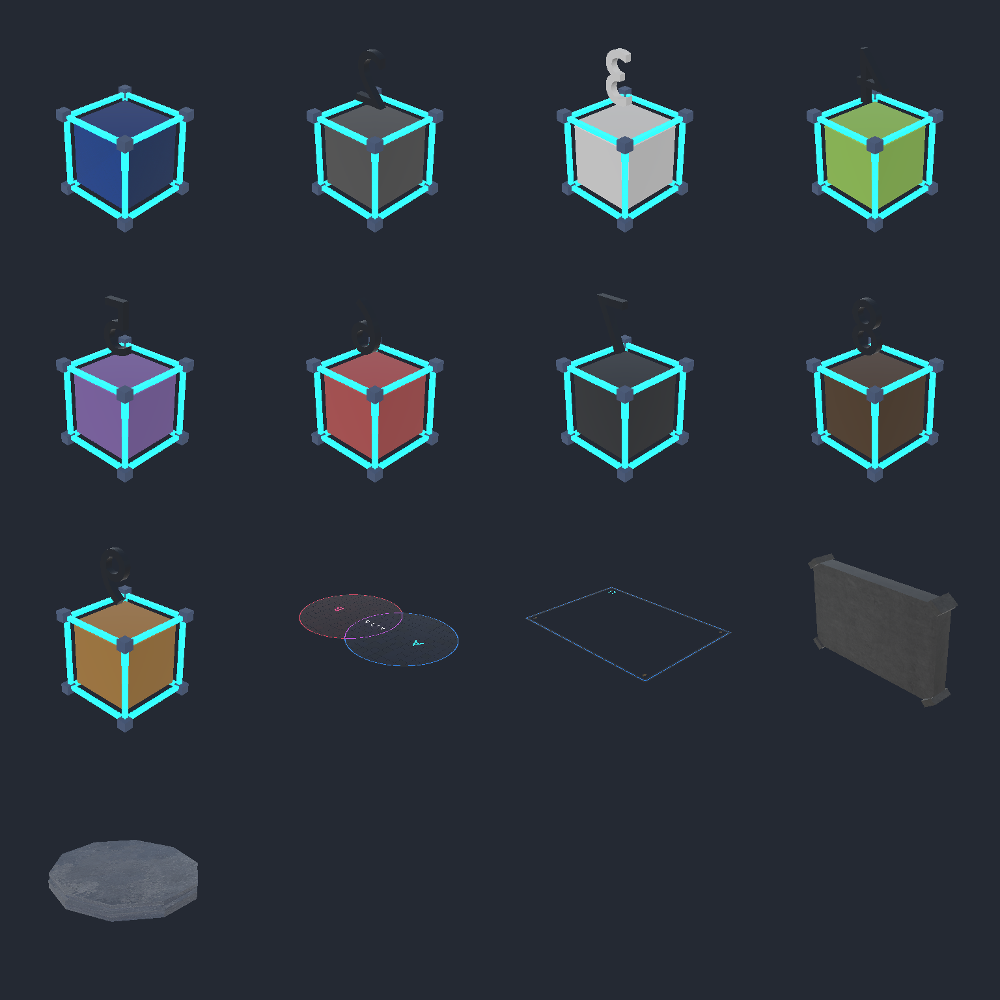

# S3L7 material repair

Verified in Unity 6000.3.6f1 on 2026-10-05. Target: `Assets/FINAL_ASSETS/MAPS/REMADE/S3L7`. Active pipeline: Universal Render Pipeline 17.3.0.

## Current cause

The numbered FBXs and their metadata have been replaced since the previous repair. Their current GUIDs differ from the earlier assets and their material remaps were empty. AB and BORDERLINES retained their existing shared materials and remaps. The folder now contains 13 models, including Board and Spawner; model 3 also has an additional solid-color material slot.

The numbered models, AB, and BORDERLINES reference an absolute path on the exporting computer ending in `Assets/Art/SetsGameplay/SetsGameplay_Palette.png`. That PNG is missing and is not embedded in the exports. The supplied 64×64 palette JPG is available. Unity otherwise imports textureless surface materials and uniform-white glow. Board references missing `STONE.webp`. Spawner references `SchoolRoofPlates.png`, which exists elsewhere in this project.

## Repair

- Restored explicit importer remaps to shared materials for all 13 models and all 32 submesh slots, preserving the source slot order.
- Reused the existing palette surface, glow, and seven solid-color material assets and their GUIDs. Created the newly needed `Material.034`, `Board_Stone`, and `Spawner_Surface` materials. There are 12 shared external materials in total.
- Assigned the supplied `408a5571-c422-4345-8104-1e4f5a8e348a.jpg` to the surface and glow base maps and glow emission map. Kept white base tint, unit tiling, zero offset, and all original palette UVs.
- Retained the exported surface metallic 0.12 and smoothness 0.42, and glow metallic 0.12, smoothness 0.70, and emission strength 3. All solid-color slots retain their exported colors, metallic 0, smoothness 0.50, and no texture or emission. Model 3's `Material.034` is a light neutral solid color in the current export.
- Assigned the supplied dark stone `acaa2379-1b7c-4be9-b089-9fb099d18f30.jpg` to Board as a substitute for its missing source texture, using its existing UVs and unit tiling.
- Assigned the existing original `Assets/FINAL_ASSETS/MAPS/REMADE/REMAKE TUTS/GARDEN/SchoolRoofPlates.png` to Spawner. The supplied `1f69c6b2-ac35-426f-ae9f-94e7789d06be.jpg` shows the same roof pattern, but the available original PNG avoids the derivative's JPEG loss.
- Used the installed `Universal Render Pipeline/Lit` shader for every material.
- Kept palette sampling at sRGB, Point, Clamp, no mipmaps, and uncompressed GPU storage. Board's continuous stone texture uses sRGB, Bilinear, Repeat, mipmaps, and uncompressed GPU storage. Existing sprite identities are retained.
- Added [S3L7MaterialImporter](../../Assets/Editor/S3L7MaterialImporter.cs), scoped to these 13 FBXs in this exact folder. It automatically reconnects known exported material names during import, including the existing `.001`/`.002` aliases. It does not alter geometry or scene objects. New, differently named materials require a corresponding shared asset and mapping.

Blender's exported metallic is stored as `ReflectionFactor`, emission strength as `EmissiveFactor`, and smoothness as `sqrt(Shininess) / 10`. See [exported material values](exported_materials.json). Some FBX material records are unused by mesh polygons; only the actual mesh slots require assignments.

## Verification

Every model passed a forced reimport after the rule compiled. All 32 slots resolve to supported URP material assets under S3L7/Materials. Palette and glow textures, emission keyword and strength, and Board/Spawner textures remain assigned.

To verify recovery, both remaps were removed from `1.fbx` through the importer and the asset was reimported. The folder-specific rule restored both mappings automatically. Every model was subsequently imported again and checked.

Exact before/after snapshots of the current assets matched for vertices, indices, submesh count, normals, tangents, UV0, UV1 where present, bounds, local transforms, current model GUIDs, and mesh/transform local file identifiers. SHA-256 checks confirmed all 13 FBX files and all three supplied JPG files remain unchanged. Import settings affecting model geometry, scale, transforms, and UV generation were retained.

The active Sets scene contains AB and BORDERLINES model instances. Both retain their existing prefab links and match the repaired imported material arrays after reimport. No scene or prefab was edited or saved. The current GUIDs were preserved; this repair does not reverse GUID replacements that occurred before this request.

| Model | Vertices | Materials in original submesh order | Reimport |
|---|---:|---|---|
| 1.fbx | 503 | Palette surface, Glow | PASS |
| 2.fbx | 978 | Ash Highlight, Palette surface, Glow | PASS |
| 3.fbx | 1300 | Material.034, Palette surface, Glow | PASS |
| 4.fbx | 590 | Bamboo base, Palette surface, Glow | PASS |
| 5.fbx | 930 | Book Purple, Palette surface, Glow | PASS |
| 6.fbx | 1194 | Book Red, Palette surface, Glow | PASS |
| 7.fbx | 528 | Building WindowFrame, Palette surface, Glow | PASS |
| 8.fbx | 1644 | Clove Yellow Brown, Palette surface, Glow | PASS |
| 9.fbx | 1248 | Borderlines, Palette surface, Glow | PASS |
| AB.fbx | 2686 | Palette surface, Glow | PASS |
| BORDERLINES.fbx | 72 | Glow, Palette surface | PASS |
| Board.fbx | 368 | Board_Stone | PASS |
| Spawner.fbx | 190 | Spawner_Surface | PASS |

Rendered and inspected every model in an isolated Unity preview using the active URP pipeline. No S3L7-specific errors or warnings were reported. The general project refresh produced warnings about unrelated existing models; those assets were not repaired in this task. See [verification output](verification.txt).

Preview order, left to right: first row 1–4; second row 5–8; third row 9, AB, BORDERLINES, Board; fourth row Spawner.

## Missing original sources and matching limits

- **`SetsGameplay_Palette.png`**: absent from the checkout and not embedded in the FBXs. The supplied palette JPG replaces it using the original UV layout. JPEG has already altered swatch values, so an exact color match to the original PNG cannot be verified.
- **`STONE.webp` for Board**: absent from the checkout and not embedded in Board.fbx. The supplied dark stone JPG provides an appearance substitute; correspondence to the exact original stone texture cannot be verified.
- **S3L7 Blender `.blend` sources**: not supplied for these models. Exported connections and numeric material values were inspected, but original node graphs, lighting, and Blender color management cannot be compared directly.
- **`SchoolRoofPlates.png` for Spawner**: available in the existing GARDEN assets and assigned. No additional missing normal, roughness, or metallic maps are referenced by these exports.

The glow material restores emission strength. Visible bloom depends on existing scene post-processing; lighting and volumes were not changed.
